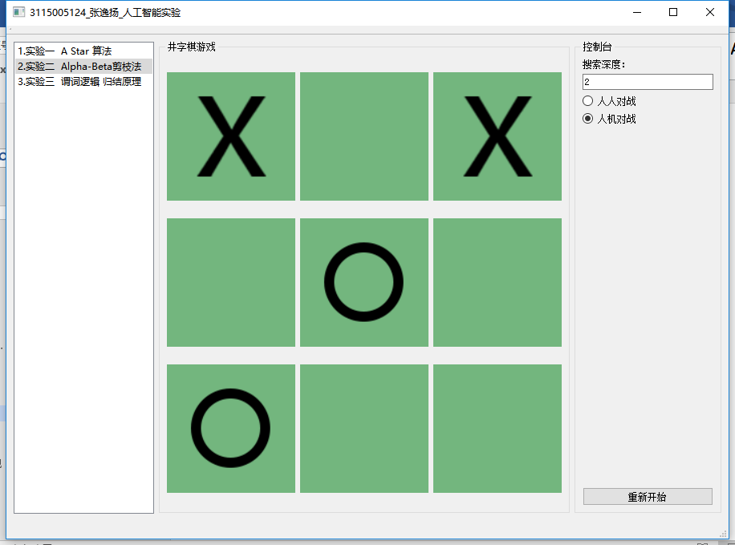

# AI_Exp

「人工智能」实验

## 实验一：A*算法求解迷宫问题
### 一、实验目的
熟悉和掌握启发式搜索的定义、估价函数和算法过程，并利用A*算法求解迷宫问题，理解求解流程和搜索顺序。
### 二、实验环境
开发语言：C++ 

编译器：Qt Creator 4.4.1(Community) MinGW_32bit

Qt版本：5.9.2
### 三、实验原理
迷宫问题可以表述为：一个存储每一个点的二维数组（isReachable=true表示点可走，反之不可走，点用（x，y）表示），寻找从某一个给定的其实单元格出发，经由行相邻或列相邻的可通过的单元格，最终可以到达目标单元格的、所走过的单元格序列。在人一个单元格中，都只能看到与它相邻的4个单元格。

A*算法是一种启发式搜索算法，它不需遍历所有节点，只是利用包含问题启发式信息的评价函数对节点进行排序，使搜索方向朝着最有可能找到目标并产生最优解的方向。它的独特之处是检查最短路径中每个可能的节点时引入了全局信息，对当前节点距终点的距离做出估计，并作为评价节点处于最短路径上的可能性度量。

A*算法中引入了评估函数，评估函数为：f（n）=g（n）+h（n） 其中：n是搜索中遇到的任意状态。g(n)是沿路径从起点到n点的移动耗费。h(n)是对n到目标状态代价的启发式估计。即评估函数f ( n) 是从初始节点到达节点n 处已经付出的代价与节点n 到达目标节点的接近程度估价值的总和。 

这里我们定义n点到目标点的最小实际距离为h（n）*，A*算法要满足的条件为：h（n）<=h（n）* 。迷宫走的时候只能往上下左右走，每走一步，代价为1，H值可以用不同的方法估算。我们这里使用的方法被称为曼哈顿方法，它计算从当前格到目的格之间水平和垂直的方格的数量总和，即： h（n）=|endPoint.x – n.x|+ |endpoint – n.y|这里endPoint表示迷宫的目标点，n表示当前点，很明显这里h（n）<=h（n）*。 所以利用f（n）=g（n）+h（n）这种策略，我们可以不断地逼近目标点，从而找到问题的解。

### 四、设计实现

▲迷宫图（EXCEL 图片）。

▲迷宫地图如图所示，棕色土地格子代表障碍物，绿色草地代表可通行区域。输入起点坐标与终点坐标x值与y值，点击“开始搜索”。显示结果。

▲输入起点坐标与终点坐标x值与y值，点击“开始搜索”。显示结果。

▲显示结果。

起点：（1, 1）

终点：（8, 8）

搜索路径：

(1,1)→(2,1)→(3,1)→(4,1)→(5,1)→(5,2)→(5,3)→(6,3)
→(6,4)→(6,5)→(7,5)→(8,5)→(8,6)→(8,7)→(8,8)

## 实验二：Alpha-beta剪枝法实现井字棋
### 一、实验目的
熟悉和掌握博弈树算法过程，并利用Alpha-beta剪枝实现人机之间井字棋对弈。AlphaBeta剪枝算法是对Minimax方法的优化，它们产生的结果是完全相同的，只不过运行效率不一样。

这种方法的前提假设与Minimax也是一样的：

1）双方都按自己认为的最佳着法行棋。

2）对给定的盘面用一个分值来评估，这个评估值永远是从一方（搜索程序）来评价的，红方有利时给一个正数，黑方有利时给一个负数。（如果红方有利时返回正数，当轮到黑方走棋时，评估值又转换到黑方的观点，如果认为黑方有利，也返回正数，这种评估方法都不适合于常规的算法描述）。

3）从我们的搜索程序（通常把它称为Max）看来，分值大的数表示对己方有利，而对于对方Min来说，它会选择分值小的着法。

### 二、实验环境
开发语言：C++ 

编译器：Qt Creator 4.4.1(Community) MinGW_32bit 

Qt版本：5.9.2

### 三、实验原理
Alpha-Beta只能用递归来实现。这个思想是在搜索中传递两个值，第一个值是Alpha，即搜索到的最好值，任何比它更小的值就没用了，因为策略就是知道Alpha的值，任何小于或等于Alpha的值都不会有所提高。

第二个值是Beta，即对于对手来说最坏的值。这是对手所能承受的最坏的结果，因为我们知道在对手看来，他总是会找到一个对策不比Beta更坏的。如果搜索过程中返回Beta或比Beta更好的值，那就够好的了，走棋的一方就没有机会使用这种策略了。

在搜索着法时，每个搜索过的着法都返回跟Alpha和Beta有关的值，它们之间的关系非常重要，或许意味着搜索可以停止并返回。

如果某个着法的结果小于或等于Alpha，那么它就是很差的着法，因此可以抛弃。因为我前面说过，在这个策略中，局面对走棋的一方来说是以Alpha为评价的。

如果某个着法的结果大于或等于Beta，那么整个节点就作废了，因为对手不希望走到这个局面，而它有别的着法可以避免到达这个局面。因此如果我们找到的评价大于或等于Beta，就证明了这个结点是不会发生的，因此剩下的合理着法没有必要再搜索。

如果某个着法的结果大于Alpha但小于Beta，那么这个着法就是走棋一方可以考虑走的，除非以后有所变化。因此Alpha会不断增加以反映新的情况。有时候可能一个合理着法也不超过Alpha，这在实战中是经常发生的，此时这种局面是不予考虑的，因此为了避免这样的局面，我们必须在博弈树的上一个层局面选择另外一个着法。

Alpha-beta剪枝技术的基本思想或算法是，边生成博弈树边计算评估各节点的倒推值，并且根据评估出的倒推值范围，及时停止扩展那些已无必要再扩展的子节点，即相当于剪去了博弈树上的一些分枝，从而节约了机器开销，提高了搜索效率。 

具体的剪枝方法如下： 

(1)  对于一个与节点 MIN，若能估计出其倒推值的上确界 ，并且这个  值不大于  MIN 的父节点(一定是或节点)的估计倒推值的下确界 ，即 ，则就不必再扩展该MIN 节点的其余子节点了(因为这些节点的估值对 MIN 父节点的倒推值已无任何影响了)。这一过程称为  剪枝。 

(2)  对于一个或节点 MAX，若能估计出其倒推值的下确界 ，并且这个  值不小于  MAX 的父节点(一定是与节点)的估计倒推值的上确界 ，即 ，则就不必再扩展该 MAX 节点的其余子节点了(因为这些节点的估值对 MAX 父节点的倒推值已无任何影响了)。这一过程称为  剪枝。

从算法中看到： 

(1) MAX 节点(包括起始节点)的  值永不减少； 

(2) MIN 节点(包括起始节点)的  值永不增加。 

在搜索期间， 和  值的计算如下： 

(1)  一个 MAX 节点的  值等于其后继节点当前最大的最终倒推值。 

(2)  一个 MIN 节点的  值等于其后继节点当前最小的最终倒推值。

### 四、设计实现

▲运行程序，搜索深度默认为2。选择“人人对战”，开始游戏。

▲选择“人机对战”，开始游戏。电脑使用极大极小算法计算。

▲选择“人机对战”，开始游戏。圈为人类，叉为电脑。

▲结果平局。

▲结果败局（人类败）。

## 实验三：谓词逻辑与归结原理的实现
### 一、实验目的
    设已知： 
    (1)能阅读者是识字的；
    (2)海豚不识字；
    (3)有些海豚是很聪明的；
    试证明：有些聪明者并不能阅读。
    证：首先，定义如下谓词：
    R(X)：X能阅读。
    L(X)：X识字。
    I(X)：X是聪明的。
    D(X)：X是海豚。
    然后把上述各语句翻译为谓词公式：
    ∀(X) (R (X) → L(X))
    ∀(X) (D (X) → ﹁L (X))
    ∃(X) (D (X) ∧ I(X))
    ∃(X) (I(X) ∧ ﹁R (X))
    根据以上题设的谓词公式，运用归结原理，推理出结果。 
### 二、实验环境
开发语言：C++ 

编译器：Qt Creator 4.4.1(Community) MinGW_32bit 

Qt版本：5.9.2

### 三、实验原理
谓词，在谓词逻辑中，原子命题分解成个体词和谓词。 个体词是可以独立存在的事或物，包括现实物、精神物和精神事三种。谓词则是用来刻划个体词的性质的词，即刻划事和物之间的某种关系表现的词。如“苹果”是一个现实物个体词，"苹果可以吃"是一个原子命题，“可以吃”是谓词，刻划“苹果”的一个性质，即与动物或人的一个关系。

应用归结法则的具体步骤是：①将定理或问题用逻辑形式表示。②消去存在量词，使公式中出现的所有个体变元只受全称量词约束。③构造子句集，包括将所有前提表示为子句形式；将结论否定也表示为子句形式。④证明子句集S的不可满足性，即应用归结法则和合一算法，反复推求两子句的归结式（对命题逻辑情形无需采用合一算法），直到最终推导出空子句□，即表明定理得证或问题有解。这个推理过程由计算机自动进行。
### 四、设计实现

▲点击“生成推理过程”按钮。显示结果。

▲显示结果如图。